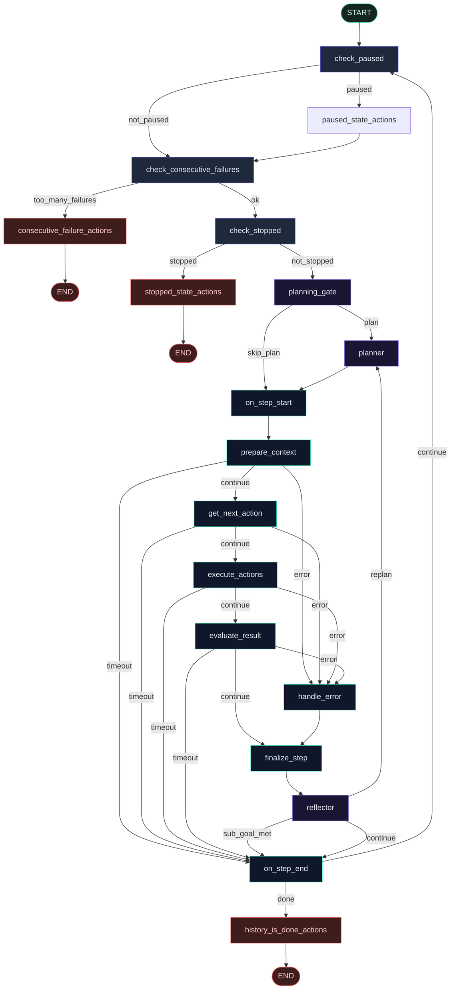

<p align="center">
  
</p>

<h1 align="center">OrchestrAI</h1>

<p align="center">
  <strong>Intelligent browser agent platform with planning, reflection & memory</strong><br/>
  Plan → Execute → Reflect · Episodic Memory · Event-Sourced Logging · Full BYOK
</p>

<p align="center">
  <a href="https://github.com/dv7453/OrchestrAI"></a>
  
  
  
  
  
  
  
</p>

<p align="center">
  <a href="#-why-orchestrai">Why</a> ·
  <a href="#-architecture">Architecture</a> ·
  <a href="#-v3-whats-new">What's New in V3</a> ·
  <a href="#-langgraph-agent-graph">Graph</a> ·
  <a href="#-project-structure">Structure</a> ·
  <a href="#-usage">Usage</a> ·
  <a href="#-api">API</a>
</p>

---

## What it is

**OrchestrAI** is an intelligent browser automation platform that **plans tasks, executes them through a LangGraph state machine, reflects on outcomes, and learns from past runs**.

Built on browser-use and LangGraph, it transforms reactive step loops into a structured **Plan → Execute → Reflect** pipeline with persistent episodic memory and full execution tracing.

| Layer | Role |
|-------|------|
| **browser-use** | Hands — Chromium actions, DOM, clicks |
| **Planner + Reflector** | Intelligence — task decomposition, sub-goal evaluation, re-planning |
| **LangGraph** | Brain schedule — 18-node state machine with 7 routers |
| **Event Store** | Memory — SQLite execution log, episodic memory for learning |
| **FastAPI** | Remote control — run / stop / stream events |
| **Web UI** | Cockpit — live screenshots, sub-goal checklist, activity log |

> Use **browser-use** for one-off scripts.  
> Use **OrchestrAI** when the agent is part of a **system** that plans, learns, and improves with every run.

---

## Run it yourself

Clone the repo and run locally — that's the supported way to use OrchestrAI.

<p align="center">
  
  &nbsp;&nbsp;
  
  &nbsp;&nbsp;
  
  &nbsp;&nbsp;
  
</p>

<p align="center">
  <sub>Supported providers — Groq · OpenAI · Claude (Anthropic) · Mistral (full BYOK)</sub>
</p>

---

## V3: What's New

OrchestrAI V3 is a ground-up architectural upgrade. The system evolved from a **browser-use wrapper** into an **intelligent agent platform**.

### Plan → Execute → Reflect

Every task is decomposed into **sub-goals** with explicit **success criteria** before execution begins. After each step, a **reflector** evaluates whether the current sub-goal is met. On failure, the system **re-plans** instead of giving up.

```
Task: "Go to code.visualstudio.com and download VS Code for macOS"

📋 Plan:
  1. Navigate to code.visualstudio.com     → "VS Code homepage is visible"
  2. Find and click the macOS download     → "Download has started or the .dmg link is visible"

🔄 Execute: step pipeline runs scoped to sub-goal 1
✅ Reflect: "VS Code homepage is visible" — sub-goal met, advance to #2
🔄 Execute: step pipeline runs scoped to sub-goal 2
✅ Reflect: "Download link is visible" — sub-goal met, task complete
```

### Episodic Memory

The system **learns from past runs**. Successful task trajectories are stored with embeddings. When a similar task arrives, past strategies are retrieved and injected into the planning prompt as few-shot context.

```
📚 New task: "Download VS Code for Linux"
   Retrieved: "Download VS Code for macOS" (similarity: 0.94, SUCCESS, 4 steps)
   → Planner adapts the proven strategy for Linux
```

Memory uses `sentence-transformers` when available, falls back to keyword similarity otherwise.

### Event-Sourced Execution Log

Every node entry/exit, error, timeout, plan creation, sub-goal completion, and reflection is recorded as an **immutable event** in SQLite. This enables:

- **Full run replay**: Reconstruct any past execution step by step
- **Root cause debugging**: Filter to error events to find exactly where a run failed
- **Run comparison**: Compare event timelines across runs of the same task

### Bug Fix: `step_timed_out` Death Spiral

V2 had a critical bug where `step_timed_out` was set to `True` on timeout but **never cleared**. After one timeout, every subsequent step was routed as "timed out" — burning through `max_steps` doing nothing. Fixed in V3.

### V2 → V3 Comparison

| Dimension | V2 | V3 |
|---|---|---|
| **Intelligence** | Reactive step loop | Plan → Execute → Reflect with sub-goals |
| **Learning** | Every run starts from zero | Retrieves similar past successes |
| **Failure handling** | Count failures, give up | Re-plan around failures |
| **Observability** | `print()` + SSE logs | Structured event log, full execution replay |
| **Persistence** | In-memory dict | SQLite (events + memory) |
| **Graph nodes** | 15 | 18 |
| **Routers** | 5 | 7 |
| **State fields** | 4 | 7 |
| **Tests** | 36 | 74 |
| **API endpoints** | 4 | 8 |

---

## Why OrchestrAI

| Need | What you get |
|------|----------------|
| **Intelligent planning** | Tasks decomposed into sub-goals with success criteria before execution |
| **Self-correcting** | Reflector evaluates outcomes; re-plans on failure instead of giving up |
| **Learning system** | Episodic memory retrieves past strategies — improves with every run |
| **Nodal control** | Replace or extend any node without forking the whole loop |
| **Failure routing** | First-class paths for pause, stop, timeout, error, consecutive failures |
| **Full observability** | Event-sourced execution log with run replay and comparison |
| **Product API** | SSE stream (`started` / `plan` / `step` / `reflection` / `done`) for any UI |
| **LangGraph ecosystem** | Compose as a subgraph in larger agent workflows |
| **Testable reliability** | **74 unit tests**, **100% routing branch coverage** |
| **Full BYOK** | Users bring their own keys — no server-side LLM secrets required |

### Metrics

| Metric | Value |
|--------|------:|
| Graph nodes | **18** |
| Conditional routers | **7** |
| State fields | **7** |
| Routing branches covered | **15 / 15** |
| Unit tests | **74** |
| API endpoints | **8** |

---

## Architecture

```text
┌─────────────┐     POST /api/run + SSE      ┌──────────────────┐
│  Web UI /   │ ───────────────────────────► │  FastAPI Server  │
│  Dashboard  │ ◄── plan · step · done ───── │  (control plane) │
└─────────────┘                              └────────┬─────────┘
                                                      │
                                            ┌─────────▼─────────┐
                                            │   EventStore      │ SQLite
                                            │   EpisodicMemory  │ (data/)
                                            └─────────┬─────────┘
                                                      │
                                            ┌─────────▼──────────────┐
                                            │ LangGraphBrowserAgent  │
                                            │  18-node state machine │
                                            │  Plan → Execute →      │
                                            │  Reflect loop          │
                                            └─────────┬──────────────┘
                                                      │ wraps
                                                      ▼
                                            ┌────────────────────────┐
                                            │     browser-use        │
                                            │  Agent + Chromium      │
                                            └────────────────────────┘
```

**Request path**

1. Client sends natural-language `task` + provider + BYOK key  
2. Server queries **episodic memory** for similar past tasks  
3. **Planner** decomposes the task into sub-goals with success criteria  
4. Step pipeline executes actions scoped to the current sub-goal  
5. **Reflector** evaluates sub-goal completion after each step  
6. On sub-goal met → advance. On repeated failure → re-plan  
7. Each event is logged to the **event store** for replay/debugging  
8. SSE streams plan, steps, reflections, and screenshots to the client  

---

## LangGraph Agent Graph

Guards first → plan → step pipeline (prepare → decide → execute → evaluate) → reflect → loop or end.



### Step pipeline (happy path)

| Order | Node | Responsibility |
|------:|------|----------------|
| 1 | `planner` | Decompose task into sub-goals (first entry / replan only) |
| 2 | `on_step_start` | Reset flags, optional step hook |
| 3 | `prepare_context` | Capture browser/DOM state |
| 4 | `get_next_action` | LLM structured action plan |
| 5 | `execute_actions` | Click / type / navigate via Chromium |
| 6 | `evaluate_result` | Validate outcomes |
| 7 | `finalize_step` | Persist step history |
| 8 | `reflector` | Evaluate sub-goal completion, advance or replan |
| 9 | `on_step_end` | Route: done ↔ continue loop |

### Core packages

| File | Purpose |
|------|---------|
| `graph.py` | 18-node StateGraph wiring (nodes + conditional edges) |
| `nodes.py` | Node implementations: planner, reflector, step nodes, guard nodes |
| `routes.py` | 7 routers: pause, failures, stop, timeout, completion, planning, reflection |
| `state.py` | LangGraph state schema (7 fields) |
| `models.py` | Pydantic models: SubGoal, TaskPlan, ReflectionResult |
| `agent.py` | `LangGraphBrowserAgent` runtime + memory + event store |
| `server.py` | FastAPI + SSE control plane + event/memory endpoints |
| `event_store.py` | SQLite append-only execution event log |
| `memory.py` | Episodic memory with embedding retrieval |

---

## Project Structure

```text
OrchestrAI/
├── src/langgraph_browser_agent/
│   ├── __init__.py
│   ├── __main__.py              # python -m langgraph_browser_agent
│   ├── agent.py                 # LangGraphBrowserAgent wrapper
│   ├── graph.py                 # 18-node StateGraph
│   ├── nodes.py                 # Planner + reflector + step nodes
│   ├── routes.py                # 7 conditional routers
│   ├── state.py                 # BrowserAgentState TypedDict (7 fields)
│   ├── models.py                # SubGoal, TaskPlan, ReflectionResult
│   ├── event_store.py           # SQLite execution event log
│   ├── memory.py                # Episodic memory + embeddings
│   └── server.py                # FastAPI app, SSE, BYOK, event/memory APIs
│
├── frontend/
│   ├── index.html               # UI with sub-goals panel
│   ├── styles.css
│   ├── app.js                   # SSE client + plan/reflection events
│   ├── start.sh                 # Local launcher
│   └── logos/                   # Groq · OpenAI · Claude · Mistral
│
├── data/                        # SQLite databases (auto-created)
│   ├── orchestrai_events.db     # Execution event log
│   └── orchestrai_memory.db     # Episodic memory store
│
├── examples/
│   ├── run_browser_agent.py
│   ├── run_browser_agent_groq.py
│   └── download_vscode.py
│
├── tests/                       # 74 tests
│   ├── test_graph.py
│   ├── test_routes.py           # Includes planning + reflection routes
│   ├── test_nodes.py            # Includes bug fix + planner/reflector
│   ├── test_agent.py
│   ├── test_state.py            # Includes V3 state fields
│   ├── test_integration.py
│   ├── test_imports.py
│   ├── test_event_store.py      # Event store tests
│   └── test_memory.py           # Episodic memory tests
│
├── Dockerfile                   # Playwright + Chromium (Render-ready)
├── render.yaml
├── langgraph.json               # LangGraph Studio entry
├── pyproject.toml
└── README.md
```

---

## Usage

### 1) Local install

```bash
git clone https://github.com/dv7453/OrchestrAI.git
cd OrchestrAI

python3 -m venv .venv
source .venv/bin/activate          # Windows: .venv\Scripts\activate

pip install --upgrade pip
pip install -e '.[browser,server]'
playwright install chromium

cp .env.template .env
# Optional: BROWSER_USE_HEADLESS=false for a visible browser window
```

For episodic memory with semantic embeddings (optional):

```bash
pip install -e '.[memory]'
```

### 2) Start the server + UI

```bash
cd frontend && ./start.sh
# → http://127.0.0.1:8765
```

Or:

```bash
python -m langgraph_browser_agent.server
```

### 3) Run a task (UI)

1. Open the app  
2. Pick **Groq / OpenAI / Claude / Mistral**  
3. Paste your API key (saved in browser localStorage only)  
4. Describe the task, hit **Run Task**  
5. Watch the **Plan** panel populate with sub-goals  
6. Watch live screenshots + step logs  
7. See sub-goals check off as the reflector confirms completion  

Example task:

```text
Go to https://code.visualstudio.com and find the download link for macOS.
```

### 4) Run via API (SSE)

```bash
curl -N -X POST http://127.0.0.1:8765/api/run \
  -H 'Content-Type: application/json' \
  -d '{
    "task": "Go to https://example.com and tell me the page title",
    "provider": "groq",
    "model": "openai/gpt-oss-20b",
    "groq_api_key": "gsk_...",
    "headless": true
  }'
```

Stop a run:

```bash
curl -X POST http://127.0.0.1:8765/api/run/<run_id>/stop
```

Query past runs:

```bash
curl http://127.0.0.1:8765/api/runs
curl http://127.0.0.1:8765/api/runs/<run_id>/events
```

Search episodic memory:

```bash
curl "http://127.0.0.1:8765/api/memory/search?query=download+vscode&top_k=3"
```

### 5) CLI examples

```bash
python examples/run_browser_agent_groq.py
python examples/download_vscode.py
```

### 6) LangGraph Studio (optional)

```bash
pip install -e '.[studio]'
langgraph dev
```

---

## Providers (BYOK)

| Provider | `provider` value | Key field | Example models |
|----------|------------------|-----------|----------------|
| Groq | `groq` | `groq_api_key` | `openai/gpt-oss-20b`, `openai/gpt-oss-120b` |
| OpenAI | `openai` | `openai_api_key` | `gpt-4o`, `gpt-4o-mini`, `gpt-4.1` |
| Claude | `claude` | `anthropic_api_key` | `claude-sonnet-4-5`, `claude-haiku-4-5` |
| Mistral | `mistral` | `mistral_api_key` | `mistral-medium-latest`, `mistral-large-latest` |

Keys are **not stored on the server**. They are sent only with each `/api/run` request.

### Server env (optional)

| Variable | Required | Description |
|----------|----------|-------------|
| `BROWSER_USE_HEADLESS` | No | Force headless (`true` on Docker / Render) |
| `PORT` | No | Listen port (Render injects this) |

---

## API

| Endpoint | Method | Description |
|----------|--------|-------------|
| `/` | GET | Showcase Web UI |
| `/api/health` | GET | Health + version + features + providers |
| `/api/run` | POST | Start agent (SSE stream) |
| `/api/run/{id}/stop` | POST | Cancel active run |
| `/api/runs` | GET | List recent runs (event store) |
| `/api/runs/{id}/events` | GET | Full event timeline + summary |
| `/api/memory` | GET | List stored episodes |
| `/api/memory/search` | GET | Search memory by similarity |

### SSE events

| Event | Payload highlights |
|-------|---------------------|
| `started` | `run_id` |
| `memory_context` | `count`, `episodes` (similar past tasks) |
| `plan` | `sub_goals` (descriptions + success criteria) |
| `log` | `message` |
| `step` | `step`, `url`, `title`, `goal`, `screenshot` (base64) |
| `reflection` | `sub_goal_met`, `sub_goal_index`, `reasoning` |
| `error` | `message` |
| `done` | `success`, `result`, `run_id`, `steps` |

---

## Tests & quality

```bash
pytest tests/ -v
# 74 passed in ~1s
```

| Suite | Tests | Focus |
|-------|------:|-------|
| `test_graph.py` | 5 | Graph construction / compilation |
| `test_routes.py` | 18 | All routing branches (incl. planning + reflection) |
| `test_nodes.py` | 11 | Node behavior (incl. bug fix verification) |
| `test_agent.py` | 5 | Agent wrapper |
| `test_state.py` | 4 | State schema (incl. V3 fields) |
| `test_integration.py` | 4 | End-to-end graph paths |
| `test_imports.py` | 5 | Import smoke tests |
| `test_event_store.py` | 8 | Event emission, summaries, run listing |
| `test_memory.py` | 14 | Episode storage, retrieval, keyword fallback |

---

## Deploy

Docker + Playwright image included.

```bash
docker build -t orchestrai .
docker run -p 8765:8765 -e BROWSER_USE_HEADLESS=true orchestrai
```

Or connect the repo to **Render** (`render.yaml` Blueprint). No LLM keys needed on the host — users bring their own.

> Chromium needs RAM. Prefer **≥ 2GB** instances for cloud browser runs.

---

## When to use this vs browser-use

| Scenario | Prefer |
|----------|--------|
| Quick script / notebook automation | `browser-use` |
| Intelligent task execution with planning | **OrchestrAI** |
| System that learns from past runs | **OrchestrAI** |
| Service API + live progress for a dashboard | **OrchestrAI** |
| Custom recovery / pause / timeout as graph edges | **OrchestrAI** |
| Compose browser steps inside a larger LangGraph app | **OrchestrAI** |
| Full execution audit trail and replay | **OrchestrAI** |
| Latest upstream browser tricks with zero wrapper | `browser-use` |

---

## Contributing

Issues and PRs welcome.

1. Fork + branch  
2. Add tests for routing / nodes when you change control flow  
3. Run `pytest tests/ -v` to verify all 74 tests pass  
4. Open a PR with a short "why"  

If this helps your stack, a **star** on the repo goes a long way.

---

## Version History

### V3 (Current)

Architectural upgrade to an intelligent agent platform:
- **Plan → Execute → Reflect**: Tasks decomposed into sub-goals with success criteria; reflector evaluates outcomes and triggers re-planning
- **Episodic Memory**: Learns from past runs; retrieves similar successful strategies as planning context
- **Event-Sourced Log**: Every execution event stored in SQLite for replay, debugging, and auditing
- **Bug Fix**: `step_timed_out` death spiral eliminated
- **18 nodes**, **7 routers**, **7 state fields**, **74 tests**, **8 API endpoints**

### V2

LangGraph state machine wrapping browser-use with a FastAPI + SSE control plane and showcase Web UI. 15 nodes, 5 routers, 36 tests.

---

<p align="center">
  <sub>Built with LangGraph · browser-use · FastAPI · Playwright</sub><br/>
  <a href="https://github.com/dv7453/OrchestrAI">github.com/dv7453/OrchestrAI</a>
</p>
