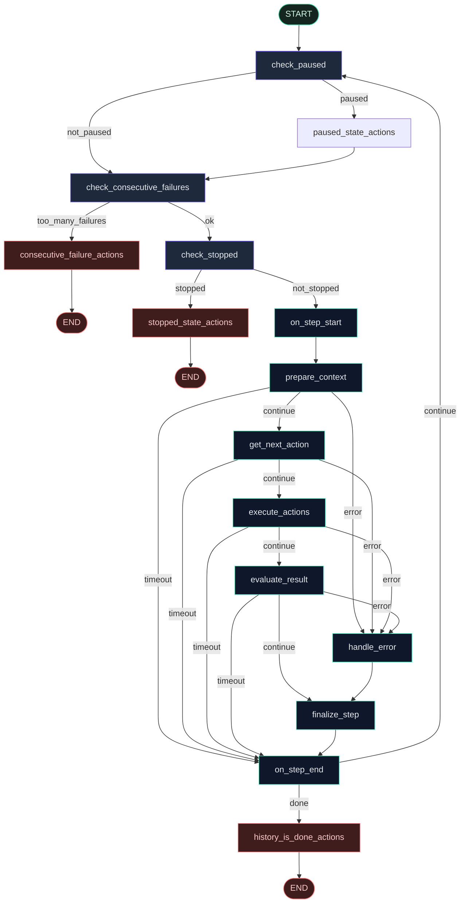

<p align="center">
  
</p>

<h1 align="center">OrchestrAI</h1>

<p align="center">
  <strong>LangGraph runtime for browser agents</strong><br/>
  Explicit nodal orchestration · FastAPI streaming control plane · Full BYOK
</p>

<p align="center">
  <a href="https://github.com/dv7453/OrchestrAI"></a>
  
  
  
  
  
  
  
</p>

<p align="center">
  <a href="#-why-orchestrai">Why</a> ·
  <a href="#-architecture">Architecture</a> ·
  <a href="#-langgraph-agent-graph">Graph</a> ·
  <a href="#-project-structure">Structure</a> ·
  <a href="#-usage">Usage</a> ·
  <a href="#-api">API</a>
</p>

---

## What it is

**OrchestrAI** turns opaque browser-agent loops into an **explicit, testable LangGraph state machine**, then exposes them as a **FastAPI + SSE service** you can plug into dashboards, internal tools, or your own cloud.

| Layer | Role |
|-------|------|
| **browser-use** | Hands — Chromium actions, DOM, clicks |
| **LangGraph** | Brain schedule — nodal control flow, routing, recovery |
| **FastAPI** | Remote control — run / stop / stream events |
| **Web UI** | Showcase cockpit — live screenshots + activity |

> Use **browser-use** for one-off scripts.  
> Use **OrchestrAI** when the agent is part of a **system** you need to operate, extend, and ship.

---

## Run it yourself

Clone the repo and run locally — that’s the supported way to use OrchestrAI.

<p align="center">
  
  &nbsp;&nbsp;
  
  &nbsp;&nbsp;
  
  &nbsp;&nbsp;
  
</p>

<p align="center">
  <sub>Supported providers — Groq · OpenAI · Claude (Anthropic) · Mistral (full BYOK)</sub>
</p>

---

## Why OrchestrAI

| Need | What you get |
|------|----------------|
| **Nodal control** | Replace or extend `prepare_context`, `get_next_action`, `execute_actions`, etc. without forking the whole loop |
| **Failure routing** | First-class paths for pause, stop, timeout, error, consecutive failures |
| **Product API** | SSE stream (`started` / `log` / `step`+screenshot / `done`) for any UI |
| **LangGraph ecosystem** | Compose as a subgraph in larger agent workflows |
| **Testable reliability** | **36 unit tests**, **100% routing branch coverage** |
| **Full BYOK** | Users bring their own keys — no server-side LLM secrets required |

### Metrics

| Metric | Value |
|--------|------:|
| Graph nodes | **15** |
| Graph edges | **28** |
| Conditional routers | **5** |
| State fields | **4** |
| Routing branches covered | **11 / 11** |
| Unit tests | **36** |

---

## Architecture

```text
┌─────────────┐     POST /api/run + SSE      ┌──────────────────┐
│  Web UI /   │ ───────────────────────────► │  FastAPI Server  │
│  Dashboard  │ ◄── log · step · done ────── │  (control plane) │
└─────────────┘                              └────────┬─────────┘
                                                      │
                                                      ▼
                                         ┌────────────────────────┐
                                         │ LangGraphBrowserAgent  │
                                         │  15-node state machine │
                                         └────────────┬───────────┘
                                                      │ wraps
                                                      ▼
                                         ┌────────────────────────┐
                                         │     browser-use        │
                                         │  Agent + Chromium      │
                                         └────────────────────────┘
```

**Request path**

1. Client sends natural-language `task` + provider + BYOK key  
2. Server builds LLM client + browser-use `Agent`  
3. `LangGraphBrowserAgent` runs the step graph  
4. Each step streams URL, goal, and screenshot over SSE  
5. Graph routes to completion, retry, or controlled stop  

---

## LangGraph Agent Graph

Guards first → one step (prepare → decide → execute → evaluate) → loop or end.



### Step pipeline (happy path)

| Order | Node | Responsibility |
|------:|------|----------------|
| 1 | `on_step_start` | Optional step hook |
| 2 | `prepare_context` | Capture browser/DOM state |
| 3 | `get_next_action` | LLM structured action plan |
| 4 | `execute_actions` | Click / type / navigate via Chromium |
| 5 | `evaluate_result` | Validate outcomes |
| 6 | `finalize_step` | Persist step history |
| 7 | `on_step_end` | Route: done ↔ continue loop |

### Core packages

| File | Purpose |
|------|---------|
| `graph.py` | StateGraph wiring (nodes + conditional edges) |
| `nodes.py` | Node implementations wrapping browser-use |
| `routes.py` | Pause / failures / stop / timeout / completion routers |
| `state.py` | LangGraph state schema |
| `agent.py` | `LangGraphBrowserAgent` runtime + SIGINT pause/resume |
| `server.py` | FastAPI + SSE control plane |

---

## Project Structure

```text
OrchestrAI/
├── src/langgraph_browser_agent/
│   ├── __init__.py
│   ├── __main__.py              # python -m langgraph_browser_agent
│   ├── agent.py                 # LangGraphBrowserAgent wrapper
│   ├── graph.py                 # 15-node / 28-edge StateGraph
│   ├── nodes.py                 # Step + guard node logic
│   ├── routes.py                # Conditional routing functions
│   ├── state.py                 # BrowserAgentState TypedDict
│   └── server.py                # FastAPI app, SSE, BYOK providers
│
├── frontend/
│   ├── index.html               # Showcase UI
│   ├── styles.css
│   ├── app.js                   # SSE client + provider picker
│   ├── start.sh                 # Local launcher
│   └── logos/                   # Groq · OpenAI · Claude · Mistral
│
├── examples/
│   ├── run_browser_agent.py
│   ├── run_browser_agent_groq.py
│   └── download_vscode.py
│
├── tests/                       # 36 tests — graph, routes, nodes, agent
├── Dockerfile                   # Playwright + Chromium (Render-ready)
├── render.yaml
├── langgraph.json               # LangGraph Studio entry
├── pyproject.toml
└── README.md
```

---

## Usage

### 1) Local install

```bash
git clone https://github.com/dv7453/OrchestrAI.git
cd OrchestrAI

python3 -m venv .venv
source .venv/bin/activate          # Windows: .venv\Scripts\activate

pip install --upgrade pip
pip install -e '.[browser,server]'
playwright install chromium

cp .env.template .env
# Optional: BROWSER_USE_HEADLESS=false for a visible browser window
```

### 2) Start the server + UI

```bash
cd frontend && ./start.sh
# → http://127.0.0.1:8765
```

Or:

```bash
python -m langgraph_browser_agent.server
```

### 3) Run a task (UI)

1. Open the app  
2. Pick **Groq / OpenAI / Claude / Mistral**  
3. Paste your API key (saved in browser localStorage only)  
4. Describe the task, hit **Run Task**  
5. Watch live screenshots + step logs  

Example task:

```text
Go to https://example.com and tell me the page title.
```

### 4) Run via API (SSE)

```bash
curl -N -X POST http://127.0.0.1:8765/api/run \
  -H 'Content-Type: application/json' \
  -d '{
    "task": "Go to https://example.com and tell me the page title",
    "provider": "groq",
    "model": "openai/gpt-oss-20b",
    "groq_api_key": "gsk_...",
    "headless": true
  }'
```

Stop a run:

```bash
curl -X POST http://127.0.0.1:8765/api/run/<run_id>/stop
```

### 5) CLI examples

```bash
python examples/run_browser_agent_groq.py
python examples/download_vscode.py
```

### 6) LangGraph Studio (optional)

```bash
pip install -e '.[studio]'
langgraph dev
```

---

## Providers (BYOK)

| Provider | `provider` value | Key field | Example models |
|----------|------------------|-----------|----------------|
| Groq | `groq` | `groq_api_key` | `openai/gpt-oss-20b`, `openai/gpt-oss-120b` |
| OpenAI | `openai` | `openai_api_key` | `gpt-4o`, `gpt-4o-mini`, `gpt-4.1` |
| Claude | `claude` | `anthropic_api_key` | `claude-sonnet-4-5`, `claude-haiku-4-5` |
| Mistral | `mistral` | `mistral_api_key` | `mistral-medium-latest`, `mistral-large-latest` |

Keys are **not stored on the server**. They are sent only with each `/api/run` request.

### Server env (optional)

| Variable | Required | Description |
|----------|----------|-------------|
| `BROWSER_USE_HEADLESS` | No | Force headless (`true` on Docker / Render) |
| `PORT` | No | Listen port (Render injects this) |

---

## API

| Endpoint | Method | Description |
|----------|--------|-------------|
| `/` | GET | Showcase Web UI |
| `/api/health` | GET | Health + supported providers |
| `/api/run` | POST | Start agent (SSE stream) |
| `/api/run/{id}/stop` | POST | Cancel active run |

### SSE events

| Event | Payload highlights |
|-------|--------------------|
| `started` | `run_id` |
| `log` | `message` |
| `step` | `step`, `url`, `title`, `goal`, `screenshot` (base64) |
| `error` | `message` |
| `done` | `success`, `result` |

---

## Tests & quality

```bash
pytest tests/ -v
```

| Suite | Focus |
|-------|-------|
| `test_graph.py` | Graph construction / compilation |
| `test_routes.py` | All routing branches |
| `test_nodes.py` | Node behavior |
| `test_agent.py` | Agent wrapper |
| `test_state.py` | State schema |
| `test_integration.py` | End-to-end graph paths |

---

## Deploy

Docker + Playwright image included.

```bash
docker build -t orchestrai .
docker run -p 8765:8765 -e BROWSER_USE_HEADLESS=true orchestrai
```

Or connect the repo to **Render** (`render.yaml` Blueprint). No LLM keys needed on the host — users bring their own.

> Chromium needs RAM. Prefer **≥ 2GB** instances for cloud browser runs.

---

## When to use this vs browser-use

| Scenario | Prefer |
|----------|--------|
| Quick script / notebook automation | `browser-use` |
| Service API + live progress for a dashboard | **OrchestrAI** |
| Custom recovery / pause / timeout as graph edges | **OrchestrAI** |
| Compose browser steps inside a larger LangGraph app | **OrchestrAI** |
| Latest upstream browser tricks with zero wrapper | `browser-use` |

---

## Contributing

Issues and PRs welcome.

1. Fork + branch  
2. Add tests for routing / nodes when you change control flow  
3. Open a PR with a short “why”  

If this helps your stack, a **star** on the repo goes a long way.

---

## Note on V2

OrchestrAI V2 rebuilt orchestration from an earlier multi-agent description into a **LangGraph state machine wrapping browser-use** — more accurate, testable, and closer to how the agent actually runs.

The Web UI is a **showcase**. The open-source product is the **graph + FastAPI control plane**.

---

<p align="center">
  <sub>Built with LangGraph · browser-use · FastAPI · Playwright</sub><br/>
  <a href="https://github.com/dv7453/OrchestrAI">github.com/dv7453/OrchestrAI</a>
</p>
